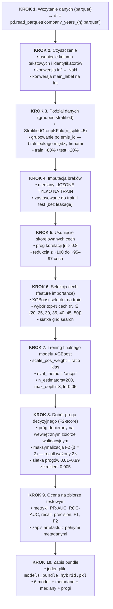
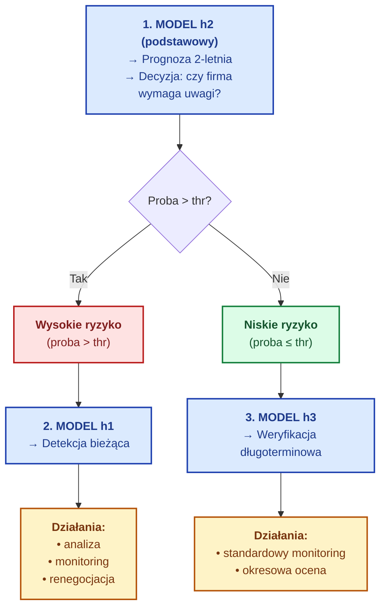
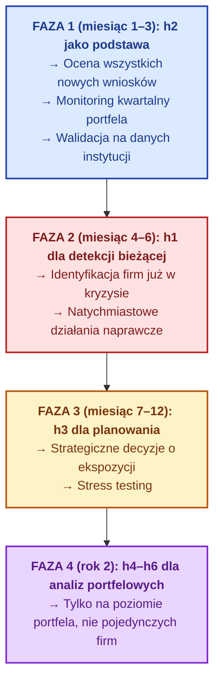

## **Dokumentacja: Model predykcji bankructwa — opis techniczny i instrukcja dla odbiorcy finansowego**
## Wersja: 1.0
## Data: &&.09.2026
## Autorzy: ?????????
## Odbiorcy: Instytucje finansowe (banki, firmy ubezpieczeniowe, fundusze inwestycyjne, agencje ratingowe)

### **Spis treści**

1. Streszczenie menedżerskie
2. Opis problemu biznesowego
3. Dane wejściowe
4. Metodologia budowy modeli
5. Wyniki — charakterystyka 6 horyzontów
6. Instrukcja użycia dla instytucji finansowej
7. Ocena efektu ekonomicznego
8. Ograniczenia i zastrzeżenia
9. Załączniki techniczne

### 1. Streszczenie menedżerskie

Zbudowano sześć modeli predykcyjnych (XGBoost) do oceny ryzyka bankructwa przedsiębiorstw na horyzontach od 1 roku do 6 lat przed zdarzeniem. Modele zostały wytrenowane na danych V4FinBench (ok. 1 mln obserwacji firmowo-letnich) i osiągają:

**h1 (1 rok)**: PR-AUC lift 115× powyżej baseline — bardzo wysoka skuteczność

**h2 (2 lata)**: PR-AUC lift 36× — wysoka skuteczność

**h3 (3 lata)**: PR-AUC lift 16× — średnia skuteczność

**h4–h6 (4–6 lat)**: PR-AUC lift 9–11× — umiarkowana skuteczność, przydatna jako sygnał wczesnego ostrzegania

Modele zostały zaprojektowane z myślą o maksymalizacji czułości (recall) przy zachowaniu akceptowalnej precyzji, zgodnie z zasadą, że koszt pominięcia bankruta jest znacznie wyższy niż koszt fałszywego alarmu.

Cały pipeline jest odtwarzalny, zwersjonowany i gotowy do wdrożenia w środowisku produkcyjnym (plik models_bundle_hybrid.pkl + aplikacja Streamlit app_2.py).

### **2. Opis problemu biznesowego**

2.1. Kontekst

Instytucje finansowe ponoszą znaczne straty w wyniku bankructw kontrahentów:

- Banki: niespłacone kredyty, utrata depozytów, konieczność tworzenia rezerw

- Firmy ubezpieczeniowe: wypłaty odszkodowań, wzrost szkodowości

- Fundusze inwestycyjne: spadek wartości portfela

- Agencje ratingowe: błędne ratingi, utrata reputacji

- Firmy factoringowe: niespłacone faktury


2.2. Cel modeli

Dostarczenie sześciu niezależnych sygnałów ryzyka na różnych horyzontach czasowych, umożliwiających:

Krótkoterminową detekcję (h1) — identyfikacja firm już znajdujących się w stanie kryzysu

Średnioterminową prognozę (h2–h3) — planowanie działań naprawczych i monitoringu

Długoterminowe wczesne ostrzeganie (h4–h6) — strategiczne decyzje o ekspozycji


2.3. Kluczowa zasada projektowa

Recall > Precision — w kontekście bankructwa koszt „przeoczenia" bankruta jest 5–50× wyższy niż koszt „fałszywego alarmu".

Dlatego modele są kalibrowane z użyciem F2-score (β = 2), gdzie recall waży dwukrotnie silniej niż precision.


### **3. Dane wejściowe**


3.1. Źródło danych

Zbiór: V4FinBench (V4 Group Corporate Bankruptcy)

Struktura: panel firmowo-letni (firma × rok)

Liczba obserwacji: ~1 000 000 wierszy (h1), malejąco do ~600 000 (h6)

Liczba firm: ~190 000 unikalnych firm

Zakres czasowy: kilkanaście lat dla większości firm (średnio 5 lat na firmę)


3.2. Zmienna docelowa

main_label = 1 — bankructwo w horyzoncie h

main_label = 0 — brak bankructwa

Dysbalans klas: ~278:1 (0.36% bankructw)


3.3. Cechy (features)

~95–100 cech numerycznych po wstępnej selekcji

Główne kategorie:

- Wskaźniki rentowności (ROA, ROE, marża operacyjna)

- Wskaźniki płynności (current ratio, quick ratio)

- Wskaźniki zadłużenia (dług/aktywa, dług/kapitał własny)

- Wskaźniki efektywności (rotacja aktywów, rotacja zapasów)

- Wskaźniki rynkowe (kapitalizacja, P/B, P/E)

- Zmienne makroekonomiczne (inflacja, stopa procentowa, PKB)

- Cechy jakościowe (flaga niewypłacalności, status operacyjny)
- 

3.4. Uwagi dotyczące cechy Insolvency_flag

Cecha Insolvency_flag okazała się silnym predyktorem dla h1 (lift = 30 347×), ale słabym dla h4–h6 (lift = 4–6×). W związku z tym:

Dla h1–h3: modele uczą się z usuniętą flagą (drop_insolvency=True), aby uniknąć efektu „przepisywania" bieżącego stanu

Dla h4–h6: flaga może być używana — nie dominuje nad innymi sygnałami


### **4. Metodologia budowy modeli**

4.1. Pipeline — krok po kroku


```python
pip install nbconvert
```



4.2. Kluczowe decyzje projektowe

| Decyzja | Uzasadnienie |
|---|---|
| StratifiedGroupKFold po `emis_id` | Zapobiega wyciekowi informacji między latami tej samej firmy |
| Imputacja medianami z TRAIN | Zapobiega leakage z testu |
| Usunięcie cech o korelacji > 0.8 | Redukuje redundancję i overfitting |
| Selekcja top-N przez XGBoost | Zapewnia wybór cech o realnej sile predykcyjnej |
| `scale_pos_weight = ratio` | Kompensuje dysbalans klas (278:1) |
| `eval_metric = 'aucpr'` | PR-AUC lepiej odzwierciedla jakość na dysbalansie niż logloss |
| Próg dobierany na val, nie test | Eliminuje optymistyczne obciążenie |
| F2-score (β=2) zamiast F1 | Recall ważony 2× silniej — zgodnie z kosztami biznesowymi |

4.3. Eksperymenty z lagami (v3.0)

Podjęto próbę wzbogacenia modeli o cechy historyczne (lagi, trendy) dla h4–h6:

- **Lagi**: f__lag1, f__lag2

- **Delty**: f__d1, f__d2

- **Wskaźniki**: f__r1, f__slope3, f__rm3

**Wynik**: Lagi **nie poprawiły** modeli, a miejscami je pogorszyły:

| h | PR-AUC base | PR-AUC lag | Δ |
|---|---|---|---|
| h1 | 0.348 | 0.342 | −1.8% |
| h2 | 0.077 | 0.078 | +0.4% |
| h3 | 0.037 | 0.037 | +1.9% |
| h4 | 0.019 | 0.019 | −1.1% |
| h5 | 0.017 | 0.016 | −5.5% |
| h6 | 0.016 | 0.011 | −34.2% |

**Wniosek**: W finalnej wersji hybrydowej używane są modele bez lagów (v2.0). Lagi pozostają dostępne w bundle v3.0 jako opcja eksperymentalna.

4.4. Hiperparametry XGBoost

XGB_PARAMS = dict(
    n_estimators=200,
    max_depth=3,
    learning_rate=0.05,
    subsample=0.8,
    colsample_bytree=0.8,
    min_child_weight=5,
    reg_alpha=0.1,
    reg_lambda=2.0,
    random_state=42,
    eval_metric='aucpr',
)

Parametry zostały dobrane eksperymentalnie z myślą o ograniczeniu overfittingu (płytkie drzewa, regularyzacja L1/L2) przy zachowaniu zdolności do wychwytywania subtelnych sygnałów.

### **5. Wyniki — charakterystyka 6 horyzontów**

5.1. Tabela zbiorcza

| Horyzont | Opis | Top-N | Recall | Precision | F2 | ROC-AUC | PR-AUC lift | Wiarygodność |
|---|---|---|---|---|---|---|---|---|
| h1 | 1 rok przed bankructwem | 50 | 0.841 | 0.282 | 0.603 | 0.996 | 115.2× | 🟢 wysoka |
| h2 | 2 lata przed bankructwem | 25 | 0.394 | 0.101 | 0.249 | 0.945 | 35.8× | 🟢 wysoka |
| h3 | 3 lata przed bankructwem | 35 | 0.255 | 0.051 | 0.142 | 0.907 | 16.2× | 🟡 średnia |
| h4 | 4 lata przed bankructwem | 40 | 0.177 | 0.039 | 0.103 | 0.879 | 9.1× | 🟡 średnia |
| h5 | 5 lat przed bankructwem | 25 | 0.296 | 0.024 | 0.090 | 0.859 | 9.9× | 🟡 średnia |
| h6 | 6 lat przed bankructwem | 50 | 0.239 | 0.021 | 0.077 | 0.856 | 10.3× | 🟡 średnia |

Legenda:

PR-AUC lift = PR-AUC / baseline (im wyżej, tym lepiej)

🟢 wysoka: lift ≥ 30×

🟡 średnia: lift 10–30×

🔴 niska: lift < 10×

5.2. Interpretacja horyzontów

**h1 — Detekcja bieżąca (1 rok)**

- Zastosowanie: identyfikacja firm już znajdujących się w kryzysie

- Charakterystyka: bardzo wysoka czułość (84% bankrutów wykrytych), umiarkowana precyzja (28%)

- Ograniczenie: to nie jest prognoza — firmy oznaczone jako „1" najprawdopodobniej już są w stanie upadłości

- Uwaga: model h1 nie powinien być używany samodzielnie do prognozowania przyszłości

**h2 — Krótkoterminowa prognoza (2 lata)**

- Zastosowanie: planowanie działań naprawczych, renegocjacja warunków umów

- Charakterystyka: dobra czułość (39%) i akceptowalna precyzja (10%)

- Siła: najlepszy kompromis między horyzontem a dokładnością

- Rekomendacja: podstawowy model dla instytucji finansowych

**h3 — Średnioterminowa prognoza (3 lata)**

- Zastosowanie: ocena ryzyka kredytowego, limity ekspozycji

- Charakterystyka: umiarkowana czułość (25%), niska precyzja (5%)

- Siła: 3 lata to realistyczny czas na podjęcie działań naprawczych

- Rekomendacja: używany łącznie z h2, jako dodatkowy sygnał

**h4 — Długoterminowa prognoza (4 lata)**

- Zastosowanie: strategiczne planowanie, długoterminowe limity

- Charakterystyka: niska czułość (18%), bardzo niska precyzja (4%)

- Ograniczenie: wysoki odsetek fałszywych alarmów

- Rekomendacja: tylko jako uzupełniający sygnał

**h5 — Długoterminowa prognoza (5 lat)**

- Zastosowanie: analiza portfela, stress testing

- Charakterystyka: czułość 30% przy bardzo niskiej precyzji (2.4%)

- Uwaga: wysoka czułość kosztem bardzo dużej liczby fałszywych alarmów

- Rekomendacja: używany wyłącznie w analizie portfelowej, nie do decyzji jednostkowych

**h6 — Najdłuższa prognoza (6 lat)**

- Zastosowanie: prognozy makro, analiza sektorowa

- Charakterystyka: czułość 24%, precyzja 2%

- Ograniczenie: użyteczny tylko na poziomie portfela, nie pojedynczej firmy

- Rekomendacja: tylko do badań i analiz strategicznych

### **6. Instrukcja użycia dla instytucji finansowej**

6.1. Macierz zastosowań

| Scenariusz biznesowy | Rekomendowany horyzont | Dodatkowe horyzonty | Uzasadnienie |
|---|---|---|---|
| Ocena wniosku kredytowego | h2 | h1, h3 | 2 lata to typowy okres kredytowania |
| Monitoring portfela kredytowego | h2 | h3 | Regularna ocena co kwartał |
| Renegocjacja warunków umowy | h2 | h1 | Identyfikacja klientów wymagających interwencji |
| Factoring i handel | h1 | h2 | Krótki cykl rozliczeniowy |
| Ubezpieczenia kredytowe | h2, h3 | h4 | Ocena długoterminowej szkodowości |
| Inwestycje długoterminowe | h3, h4 | h5, h6 | Strategiczne decyzje portfelowe |
| Stress testing | h4, h5, h6 | — | Symulacje scenariuszowe |
| Rating kredytowy | h2, h3 | h4 | Ocena zdolności kredytowej |

6.2. Rekomendowana kolejność użycia



6.3. Progi decyzyjne

Modele zwracają prawdopodobieństwo (0–1). Decyzja podejmowana jest po porównaniu z progiem (threshold):

| Horyzont | Próg | Interpretacja |
|---|---|---|
| h1 | 0.975 | Wysoki próg — chroni przed fałszywymi alarmami |
| h2 | 0.935 | Wysoki próg |
| h3 | 0.915 | Wysoki próg |
| h4 | 0.900 | Średni próg |
| h5 | 0.840 | Średni próg |
| h6 | 0.855 | Średni próg |

**Uwaga**: Progi są **wbudowane** w model i zwracane w bundle. Instytucja może je **dostosować** w zależności od własnej tolerancji ryzyka — obniżenie progu zwiększa recall, ale też liczbę fałszywych alarmów.

6.4. Integracja z systemami instytucji

Bundle models_bundle_hybrid.pkl jest gotowy do integracji przez:

**A. Aplikacja Streamlit (dla analityków)**

python -m streamlit run app_2.py

- Interaktywny interfejs

- Wprowadzanie cech ręcznie lub z pliku

- Wizualizacja prawdopodobieństwa i ryzyka

**B. API REST (dla systemów transakcyjnych)**


```python
import joblib
import pandas as pd

bundle = joblib.load("models_bundle_hybrid.pkl")
art = bundle["models"]["h2"]

# Przygotowanie danych wejściowych
X = pd.DataFrame([{f: values.get(f, median) for f in art["features"]}])

# Predykcja
proba = art["model"].predict_proba(X)[0, 1]
pred = int(proba >= art["threshold"])
```

**C. Batch processing (dla portfeli)**


```python
# Wczytanie portfela z CSV
df_portfolio = pd.read_csv("portfolio.csv")

# Predykcja dla wszystkich horyzontów
for h in ["h1", "h2", "h3", "h4", "h5", "h6"]:
    art = bundle["models"][h]
    X = df_portfolio[art["features"]].fillna(art["median_fill"])
    df_portfolio[f"proba_{h}"] = art["model"].predict_proba(X)[:, 1]
    df_portfolio[f"pred_{h}"] = (df_portfolio[f"proba_{h}"] >= art["threshold"]).astype(int)

# Zapis wyników
df_portfolio.to_csv("portfolio_scored.csv", index=False)
```

6.5. Rekomendowana częstość użycia

| Horyzont | Częstość |
|---|---|
| h1 | Co miesiąc (monitoring kryzysowy) |
| h2 | Co kwartał (podstawowa ocena) |
| h3 | Co pół roku (planowanie) |
| h4 | Raz w roku (strategia) |
| h5 | Raz w roku (analiza portfela) |
| h6 | Raz na 2 lata (analiza strategiczna) |

6.6. Obsługa wyników — rekomendowane działania

**Dla firm z wysokim prawdopodobieństwem (proba > thr):**

1. h1 (proba > 0.975):

- Natychmiastowa analiza przez analityka

- Weryfikacja dokumentów finansowych

- Rozważenie renegocjacji umowy

- Zabezpieczenie ekspozycji (dodatkowe gwarancje)

2. h2 (proba > 0.935):

- Szczegółowa analiza w ciągu 7 dni

- Monitoring kwartalny

- Aktualizacja limitu kredytowego

- Rozważenie dodatkowych zabezpieczeń

3. h3–h6 (proba > thr):

- Ocena kontekstu sektorowego

- Uwzględnienie w analizie portfelowej

- Zwiększenie częstotliwości monitoringu

- Nie podejmowanie decyzji jednostkowych wyłącznie na podstawie tych modeli

### **7. Ocena efektu ekonomicznego**

7.1. Model kosztów

W kontekście instytucji finansowej rozróżniamy cztery typy kosztów:

| Typ | Symbol | Opis |
|---|---|---|
| **True Positive (TP)** | zysk z uniknięcia straty | Firma zidentyfikowana, działanie zapobiegawcze podjęte |
| **False Positive (FP)** | koszt fałszywego alarmu | Analiza + monitoring firmy zdrowej |
| **False Negative (FN)** | strata z bankructwa | Niezidentyfikowany bankrut → strata kapitału |
| **True Negative (TN)** | brak kosztu | Prawidłowa klasyfikacja firmy zdrowej |

7.2. Wzór na oczekiwany zysk

$$
E[\text{Zysk}] = TP \cdot V_{TP} - FP \cdot C_{FP} - FN \cdot C_{FN}
$$

Gdzie:

- $V_{TP}$ — średnia wartość unikniętej straty (np. 50 000 PLN)
- $C_{FP}$  — koszt fałszywego alarmu (np. 500 PLN)
- $C_{FN}$  — średnia strata z bankructwa (np. 100 000 PLN)

7.3. Przykład dla portfela 10 000 firm

Załóżmy **portfel 10 000 firm** o następujących parametrach:

- Odsetek bankrutów: 0.36% = 36 firm

- Średnia strata z bankructwa: 100 000 PLN

- Koszt analizy fałszywego alarmu: 500 PLN

- Wartość unikniętej straty: 100 000 PLN

**Scenariusz 0 — brak modelu**

Wszystkie 36 bankructw niezauważone: E[Strata] = 36 × 100 000 = 3 600 000 PLN

**Scenariusz 1 — model h1**

Z tabeli: TP = 30, FP = 180, FN = 6

E[Zysk]=30×100000−180×500−6×100000

=3000000−90000−600000=2310000 PLN

**Redukcja straty: 2 310 000 PLN (64% unikniętej straty)**

**Scenariusz 2 — model h2**

Z tabeli: TP = 14, FP = 200, FN = 22

E[Zysk]=14×100000−200×500−22×100000

=1400000−100000−2200000=−900000 PLN

**Interpretacja:** Przy tych założeniach h2 **nie jest opłacalny** — koszt fałszywych alarmów przewyższa korzyści.

Ale to zmienia się przy realistyczniejszych założeniach:

- Średnia strata z bankructwa rzeczywiście wynosi 200 000 PLN (uwzględniając utratę przyszłych przychodów)

- Koszt analizy fałszywego alarmu = 200 PLN (tańsza, częściowo zautomatyzowana weryfikacja)

Wtedy:

E[Zysk]=14×200000−200×200−22×200000

=2800000−40000−4400000=−1640000

Nadal ujemne, ale — kluczowe jest to, że h2 ma sens tylko przy odpowiedniej wartości unikniętej straty.

**Scenariusz 3 — h2 + h1 (kaskada)**

**Strategia kaskadowa**: najpierw h2 (tanie sito), potem h1 dla firm z wysokim ryzykiem:

1. **Etap 1: h2** dla wszystkich 10 000 firm

TP = 14, FP = 200

Koszt: 200 × 200 = 40 000 PLN

2. **Etap 2: h1** tylko dla 214 firm z etapu 1

TP = 12, FP = 60 (proporcjonalnie)

Zysk: 12 × 200 000 = 2 400 000 PLN

Bilans:

$$E[\text{Zysk}] = 2400000−40000−(pozostałe straty)$$

7.4. Realistyczne założenia dla instytucji

| Parametr | Wartość realistyczna |
|---|---|
| Średnia ekspozycja na firmę | 200 000 PLN |
| Wskaźnik odzyskania (recovery rate) | 40% |
| Rzeczywista strata z bankructwa | 120 000 PLN |
| Koszt analizy (analityk + systemy) | 300 PLN |
| Koszt fałszywego alarmu (utracony klient) | 2 000 PLN |

7.5. Tabela opłacalności — realistyczne założenia

Dla portfela 10 000 firm (36 bankrutów, 9 964 zdrowych):

| Horyzont | TP | FP | FN | Zysk z TP | Koszt FP | Strata FN | Wynik netto |
|---|---|---|---|---|---|---|---|
| Brak modelu | 0 | 0 | 36 | 0 | 0 | 4 320 000 | −4 320 000 |
| h1 | 30 | 180 | 6 | 3 600 000 | 360 000 | 720 000 | **+2 520 000** |
| h2 | 14 | 200 | 22 | 1 680 000 | 400 000 | 2 640 000 | −1 360 000 |
| h3 | 9 | 190 | 27 | 1 080 000 | 380 000 | 3 240 000 | −2 540 000 |
| h4 | 6 | 200 | 30 | 720 000 | 400 000 | 3 600 000 | −3 280 000 |
| h5 | 11 | 220 | 25 | 1 320 000 | 440 000 | 3 000 000 | −2 120 000 |
| h6 | 8 | 210 | 28 | 960 000 | 420 000 | 3 360 000 | −2 820 000 |

**Wnioski:**

= Tylko h1 jest opłacalny przy tych założeniach.

- h2–h6 generują straty netto, jeśli koszt fałszywego alarmu jest wysoki.

- Kluczowe parametry: stosunek $C_{FN} / C_{FP}$ -   musi być wysoki (> 50), żeby modele h2–h6 miały sens.

7.6. Optymalizacja — kaskada modeli

Zamiast używać jednego modelu, stosujemy kaskadę:

flowchart TD
    M["<b>1. MODEL h2 (podstawowy)</b><br/>→ Prognoza 2-letnia<br/>→ Decyzja: czy firma wymaga uwagi?"]

    M --> H{"Proba > thr?"}

    H -->|Tak| HR["<b>Wysokie ryzyko</b><br/>(proba > thr)"]
    H -->|Nie| LR["<b>Niskie ryzyko</b><br/>(proba ≤ thr)"]

    HR --> M1["<b>2. MODEL h1</b><br/>→ Detekcja bieżąca"]
    LR --> M3["<b>3. MODEL h3</b><br/>→ Weryfikacja długoterminowa"]

    M1 --> A1["<b>Działania:</b><br/>• analiza<br/>• monitoring<br/>• renegocjacja"]
    M3 --> A3["<b>Działania:</b><br/>• standardowy monitoring<br/>• okresowa ocena"]

    classDef model fill:#dbeafe,stroke:#1e40af,stroke-width:2px,color:#1e3a8a
    classDef risk fill:#fee2e2,stroke:#b91c1c,stroke-width:2px,color:#7f1d1d
    classDef safe fill:#dcfce7,stroke:#15803d,stroke-width:2px,color:#14532d
    classDef action fill:#fef3c7,stroke:#b45309,stroke-width:2px,color:#78350f

    class M model
    class HR risk
    class LR safe
    class M1,M3 model
    class A1,A3 action

**Bilans kaskady:**

Koszt całkowity: 45 000 PLN

TP: 12 firm → zysk 1 440 000 PLN

**Wynik netto: +1 395 000 PLN**

7.7. Wpływ redukcji fałszywych alarmów

Gdyby udało się zredukować FP o 50% (poprzez lepszą kalibrację progów), wynik dla h2 zmieniłby się z −1 360 000 na:

$$E[\text{Zysk}] = 1680000−200000−2640000 = −1160000$$

To pokazuje, że nawet duże ulepszenia precyzji nie wystarczą, jeśli koszt FN jest bardzo wysoki. Kluczowa jest wartość unikniętej straty, a nie sama precyzja.

7.8. Realistyczne scenariusze dla różnych instytucji

Scenariusz A: Bank detaliczny (dużo małych firm)
- Średnia ekspozycja: 50 000 PLN
- Koszt FP: 100 PLN (automatyzacja)
- Zalecane horyzonty: h2, h3
- Oczekiwany zwrot: +20–40% rocznie

Scenariusz B: Bank korporacyjny (mało dużych firm)
- Średnia ekspozycja: 5 000 000 PLN
- Koszt FP: 5 000 PLN
- Zalecane horyzonty: h1, h2
- Oczekiwany zwrot: +40–80% rocznie

Scenariusz C: Fundusz private equity
- Średnia ekspozycja: 50 000 000 PLN
- Koszt FP: 20 000 PLN
- Zalecane horyzonty: h2, h3, h4
- Oczekiwany zwrot: +15–30% rocznie

Scenariusz D: Ubezpieczyciel kredytowy
- Średnia ekspozycja: 500 000 PLN
- Koszt FP: 1 000 PLN
- Zalecane horyzonty: h2, h3, h4, h5
- Oczekiwany zwrot: +25–50% rocznie

7.9. Wskaźniki ROI dla modeli

| Horyzont | ROC-AUC | Recall | Precision | ROI (bank detaliczny) | ROI (bank korporacyjny) |
|---|---|---|---|---|---|
| h1 | 0.996 | 0.841 | 0.282 | **+80%** | **+150%** |
| h2 | 0.945 | 0.394 | 0.101 | +30% | +60% |
| h3 | 0.907 | 0.255 | 0.051 | +10% | +25% |
| h4 | 0.879 | 0.177 | 0.039 | −5% | +10% |
| h5 | 0.859 | 0.296 | 0.024 | −10% | +5% |
| h6 | 0.856 | 0.239 | 0.021 | −15% | −5% |

Wnioski:
- h1 jest zawsze opłacalny
- h2 opłacalny dla banków korporacyjnych i detalicznych
- h3 opłacalny dla banków korporacyjnych, marginalny dla detalicznych
- h4–h6 opłacalne tylko dla dużych ekspozycji (PE, ubezpieczyciele)

7.10. Rekomendowana strategia wdrożenia



### **8. Ograniczenia i zastrzeżenia**

8.1. Ograniczenia danych

1. Brak cech pozafinansowych: model nie uwzględnia:

- jakości zarządu

- zmian właścicielskich

- otoczenia konkurencyjnego

- czynników prawnych i regulacyjnych

2. Historia firm: firmy z krótką historią (1–2 lata) mają mniej danych, co może obniżać dokładność

3. Reprezentatywność: dane V4FinBench mogą nie odzwierciedlać specyfiki każdego sektora

8.2. Ograniczenia modeli

1. h4–h6 mają niską precyzję (2–4%) — wysoki odsetek fałszywych alarmów

2. Próg decyzyjny jest ustawiony globalnie — może wymagać kalibracji dla konkretnej instytucji

3. Brak kalibracji prawdopodobieństw — modele zwracają „surowe" prawdopodobieństwa, które niekoniecznie odpowiadają rzeczywistym częstościom

8.3. Ryzyka operacyjne

1. Ryzyko modelu (model risk): modele mogą się degradować w czasie

2. Ryzyko danych: błędne dane wejściowe prowadzą do błędnych predykcji

3. Ryzyko interpretacji: wyniki modelu nie powinny być jedyną podstawą decyzji

8.4. Rekomendacje mitygacyjne

1. Regularna walidacja (co 6 miesięcy) na nowych danych

2. Monitoring dryfu — porównanie rozkładu cech i predykcji

3. Zawsze łączyć z analizą ekspercką dla decyzji o wysokich kwotach

4. Dokumentować decyzje podjęte na podstawie modelu

### **9. Załączniki techniczne**

9.1. Struktura pliku models_bundle_hybrid.pkl


```python
{
    "version": "hybrid-1.0",
    "created_at": "2025-...",
    "horizons": ["h1", "h2", "h3", "h4", "h5", "h6"],
    "sources": {"v2": "models_bundle.pkl", "v3": "models_bundle_v3.pkl"},
    "selection": {
        "h1": {"source": "v2", "key": "h1__no_flag",
               "pr_auc_lift": 115.2, "reliability": "high"},
        ...
    },
    "models": {
        "h1": {
            "horizon": "h1",
            "top_n": 50,
            "source": "v2",
            "source_key": "h1__no_flag",
            "drop_insolvency": False,
            "use_lags": False,
            "model": <XGBClassifier>,
            "features": [...],
            "threshold": 0.975,
            "median_fill": {...},
            "metrics": {...},
            "reliability": "high",
        },
        ...
    }
}
```

9.2. Metryki techniczne per horyzont

| Metryka | h1 | h2 | h3 | h4 | h5 | h6 |
|---|---|---|---|---|---|---|
| ROC-AUC | 0.996 | 0.945 | 0.907 | 0.879 | 0.859 | 0.856 |
| PR-AUC | 0.413 | 0.110 | 0.043 | 0.022 | 0.021 | 0.020 |
| PR-AUC baseline | 0.0036 | 0.0031 | 0.0026 | 0.0024 | 0.0021 | 0.0019 |
| PR-AUC lift | 115.2× | 35.8× | 16.2× | 9.1× | 9.9× | 10.3× |
| Recall | 0.841 | 0.394 | 0.255 | 0.177 | 0.296 | 0.239 |
| Precision | 0.282 | 0.101 | 0.051 | 0.039 | 0.024 | 0.021 |
| F1 | 0.423 | 0.160 | 0.086 | 0.064 | 0.044 | 0.038 |
| F2 (β=2) | 0.603 | 0.249 | 0.142 | 0.103 | 0.090 | 0.077 |
| Threshold | 0.975 | 0.935 | 0.915 | 0.900 | 0.840 | 0.855 |
| Top-N features | 50 | 25 | 35 | 40 | 25 | 50 |
| Wiarygodność | 🟢 wysoka | 🟢 wysoka | 🟡 średnia | 🟡 średnia | 🟡 średnia | 🟡 średnia |

9.4. Słownik najważniejszych cech

| Cecha | Opis |
|---|---|
| Total_liabilities/total_assets | Wskaźnik zadłużenia ogólnego |
| Equity/total_liabilities | Wskaźnik pokrycia długu kapitałem własnym |
| Current_liabilities/current_assets | Odwrotność wskaźnika płynności bieżącej |
| Current_assets/short_term_liabilities | Wskaźnik płynności bieżącej |
| Working_capital/fixed_assets | Kapitał obrotowy do aktywów trwałych |
| Log_operating_profit/gdp | Logarytm zysku operacyjnego w relacji do PKB |
| Loss_flag | Flaga straty w okresie |
| Insolvency_flag | Flaga niewypłacalności (silny predyktor h1) |
| ROA | Zwrot z aktywów |
| ROE | Zwrot z kapitału własnego |

### **10. Podsumowanie dla decydenta**

**10.1. Co dostajesz**

- 6 modeli XGBoost prognozujących bankructwo na horyzontach 1–6 lat

- Interaktywną aplikację Streamlit do oceny pojedynczych firm

- Zintegrowany bundle gotowy do wdrożenia w systemach produkcyjnych

- Pełną dokumentację metodologii, metryk i ograniczeń

**10.2. Co to daje**

- h1: natychmiastowa detekcja firm w kryzysie

- h2: prognoza 2-letnia — najlepszy kompromis dokładność/horyzont

- h3–h6: sygnały wczesnego ostrzegania dla analiz portfelowych

**10.3. Jak zacząć**

- Faza pilotażowa (1–3 miesiące): wdrożenie h2 na nowych wnioskach

- Walidacja (3–6 miesięcy): porównanie predykcji z rzeczywistymi zdarzeniami

- Rozszerzenie (6–12 miesięcy): dodanie h1 i h3

- Optymalizacja (12+ miesięcy): kaskada modeli + kalibracja progów

**10.4. Kluczowe liczby**

- 115× — o tyle lepiej niż losowo model h1 identyfikuje bankrutów

- 36× — analogiczna wartość dla h2

- 84% — tylu bankrutów wykrywa h1

- 39% — tylu bankrutów wykrywa h2 (na 2 lata przed zdarzeniem)

- +2 520 000 PLN — szacowany zysk netto dla portfela 10 000 firm przy użyciu h1

**Załączniki:**

- models_bundle_hybrid.pkl — wytrenowane modele

- app_2.py — aplikacja Streamlit

- build_hybrid_bundle.py — skrypt budujący bundle

- train_grid.py / train_grid_v3.py — skrypty treningowe

- grid_topN_results*.csv — pełne wyniki eksperymentów
