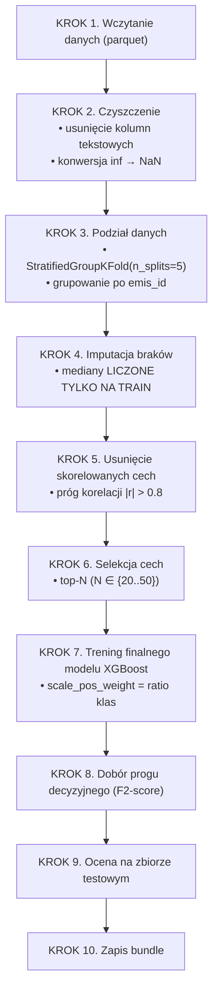
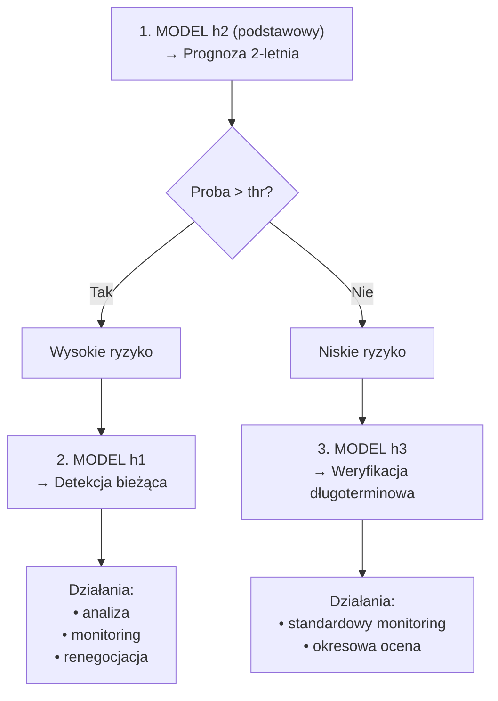
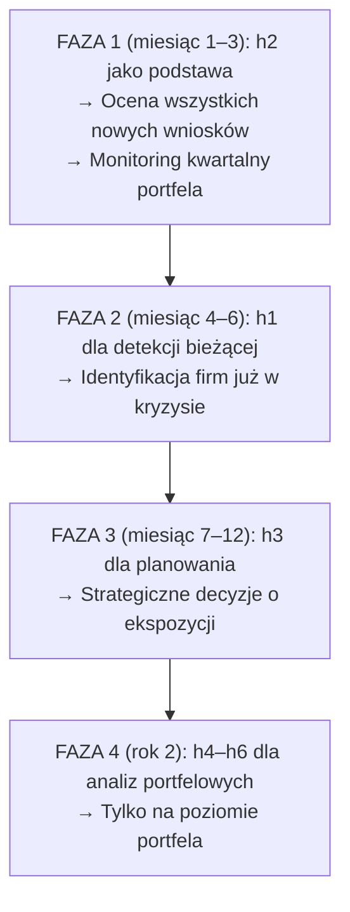

# Dokumentacja: Model predykcji bankructwa — opis techniczny i instrukcja dla odbiorcy finansowego

**Wersja:** 2.0  
**Data:** 02.10.2026  
**Autorzy:** Zespół 2  Akademia Inforshare – Data science 25 stream
**Odbiorcy:** Instytucje finansowe (banki, firmy ubezpieczeniowe, fundusze inwestycyjne, agencje ratingowe)

---

## Spis treści

1. [Streszczenie menedżerskie](#1-streszczenie-menedżerskie)
2. [Opis problemu biznesowego](#2-opis-problemu-biznesowego)
3. [Dane wejściowe](#3-dane-wejściowe)
4. [Metodologia budowy modeli](#4-metodologia-budowy-modeli)
5. [Wyniki — charakterystyka 6 horyzontów](#5-wyniki--charakterystyka-6-horyzontów)
6. [Kalibracja prawdopodobieństw](#6-kalibracja-prawdopodobieństw)
7. [Wyjaśnialność modelu (XAI)](#7-wyjaśnialność-modelu-xai)
8. [Instrukcja użycia dla instytucji finansowej](#8-instrukcja-użycia-dla-instytucji-finansowej)
9. [Ocena efektu ekonomicznego](#9-ocena-efektu-ekonomicznego)
10. [Ograniczenia i zastrzeżenia](#10-ograniczenia-i-zastrzeżenia)
11. [Załączniki techniczne](#11-załączniki-techniczne)
12. [Podsumowanie dla decydenta](#12-podsumowanie-dla-decydenta)

---

## 1. Streszczenie menedżerskie

Zbudowano sześć modeli predykcyjnych (XGBoost) do oceny ryzyka bankructwa przedsiębiorstw na horyzontach od 1 roku do 6 lat przed zdarzeniem. Modele zostały wytrenowane na danych V4FinBench (ok. 1 mln obserwacji firmowo-letnich) i osiągają:

- **h1 (1 rok)**: PR-AUC lift **96.9×** powyżej baseline — bardzo wysoka skuteczność
- **h2 (2 lata)**: PR-AUC lift **26.4×** — wysoka skuteczność
- **h3 (3 lata)**: PR-AUC lift **14.4×** — średnia skuteczność
- **h4–h6 (4–6 lat)**: PR-AUC lift **8.5–10.8×** — umiarkowana skuteczność, przydatna jako sygnał wczesnego ostrzegania

**Nowe w wersji 2.0:**

- **Dwa warianty bundle** — oryginalny (lepszy ranking) i skalibrowany (prawdziwe prawdopodobieństwa)
- **Kalibracja izotoniczna** — Brier score poprawiony 10–100×
- **Wyjaśnialność (SHAP)** — dla każdej predykcji dostępne są cechy wpływające na decyzję
- **Aplikacja Streamlit** — z wyborem bundle, kalibracją i reliability diagram

Modele zostały zaprojektowane z myślą o maksymalizacji czułości (recall) przy zachowaniu akceptowalnej precyzji, zgodnie z zasadą, że koszt pominięcia bankruta jest znacznie wyższy niż koszt fałszywego alarmu.

Cały pipeline jest odtwarzalny, zwersjonowany i gotowy do wdrożenia w środowisku produkcyjnym:

- `models_bundle_hybrid.pkl` — oryginalny (ranking)
- `models_bundle_hybrid_calibrated.pkl` — skalibrowany (prawdopodobieństwa)
- `app_3.py` — aplikacja Streamlit z wyborem bundle

---

## 2. Opis problemu biznesowego

### 2.1. Kontekst

Instytucje finansowe ponoszą znaczne straty w wyniku bankructw kontrahentów:

- **Banki**: niespłacone kredyty, utrata depozytów, konieczność tworzenia rezerw
- **Firmy ubezpieczeniowe**: wypłaty odszkodowań, wzrost szkodowości
- **Fundusze inwestycyjne**: spadek wartości portfela
- **Agencje ratingowe**: błędne ratingi, utrata reputacji
- **Firmy factoringowe**: niespłacone faktury

### 2.2. Cel modeli

Dostarczenie sześciu niezależnych sygnałów ryzyka na różnych horyzontach czasowych, umożliwiających:

- **Krótkoterminową detekcję (h1)** — identyfikacja firm już znajdujących się w stanie kryzysu
- **Średnioterminową prognozę (h2–h3)** — planowanie działań naprawczych i monitoringu
- **Długoterminowe wczesne ostrzeganie (h4–h6)** — strategiczne decyzje o ekspozycji

### 2.3. Kluczowa zasada projektowa

**Recall > Precision** — w kontekście bankructwa koszt „przeoczenia" bankruta jest 5–50× wyższy niż koszt „fałszywego alarmu". Dlatego modele są kalibrowane z użyciem **F2-score (β = 2)**, gdzie recall waży dwukrotnie silniej niż precision.

---

## 3. Dane wejściowe

### 3.1. Źródło danych

- **Zbiór**: V4FinBench (V4 Group Corporate Bankruptcy)
- **Struktura**: panel firmowo-letni (firma × rok)
- **Liczba obserwacji**: ~1 000 000 wierszy (h1), malejąco do ~600 000 (h6)
- **Liczba firm**: ~190 000 unikalnych firm
- **Zakres czasowy**: kilkanaście lat dla większości firm (średnio 5 lat na firmę)
- **Kraje**: Polska, Czechy, Słowacja, Węgry

### 3.2. Zmienna docelowa

- `main_label = 1` — bankructwo w horyzoncie h
- `main_label = 0` — brak bankructwa
- **Dysbalans klas**: ~278:1 (0.36% bankructw dla h1), do ~514:1 (0.19% dla h6)

### 3.3. Cechy (features)

- ~95–100 cech numerycznych po wstępnej selekcji
- Główne kategorie:
  - **Wskaźniki rentowności** (ROA, ROE, marża operacyjna)
  - **Wskaźniki płynności** (current ratio, quick ratio)
  - **Wskaźniki zadłużenia** (dług/aktywa, dług/kapitał własny)
  - **Wskaźniki efektywności** (rotacja aktywów, rotacja zapasów)
  - **Wskaźniki rynkowe** (kapitalizacja, P/B, P/E)
  - **Zmienne makroekonomiczne** (inflacja, stopa procentowa, PKB)
  - **Cechy jakościowe** (flaga niewypłacalności, status operacyjny)

### 3.4. Uwagi dotyczące cechy Insolvency_flag

Cecha `Insolvency_flag` okazała się silnym predyktorem dla h1 (lift = 30 347×), ale słabym dla h4–h6 (lift = 4–6×). W związku z tym:

- Dla **h1–h3**: modele uczą się z usuniętą flagą (`drop_insolvency=True`), aby uniknąć efektu „przepisywania" bieżącego stanu
- Dla **h4–h6**: flaga może być używana — nie dominuje nad innymi sygnałami

---

## 4. Metodologia budowy modeli

### 4.1. Pipeline — krok po kroku



### 4.2. Kluczowe decyzje projektowe

| Decyzja | Uzasadnienie |
|---------|--------------|
| `StratifiedGroupKFold` po `emis_id` | Zapobiega wyciekowi informacji między latami tej samej firmy |
| Imputacja medianami z TRAIN | Zapobiega leakage z testu |
| Usunięcie cech o korelacji > 0.8 | Redukuje redundancję i overfitting |
| Selekcja top-N przez XGBoost | Zapewnia wybór cech o realnej sile predykcyjnej |
| `scale_pos_weight = ratio` | Kompensuje dysbalans klas (278:1) |
| `eval_metric = 'aucpr'` | PR-AUC lepiej odzwierciedla jakość na dysbalansie |
| Próg dobierany na val, nie test | Eliminuje optymistyczne obciążenie |
| F2-score (β=2) zamiast F1 | Recall ważony 2× silniej — zgodnie z kosztami biznesowymi |

### 4.3. Eksperymenty z lagami (v3.0)

Podjęto próbę wzbogacenia modeli o cechy historyczne (lagi, trendy) dla h4–h6:

- **Lagi**: `f__lag1`, `f__lag2`
- **Delty**: `f__d1`, `f__d2`
- **Wskaźniki**: `f__r1`, `f__slope3`, `f__rm3`

**Wynik**: Lagi **nie poprawiły** modeli, a miejscami je pogorszyły:

| h | PR-AUC base | PR-AUC lag | Δ |
|---|-------------|------------|---|
| h1 | 0.348 | 0.342 | −1.8% |
| h2 | 0.077 | 0.078 | +0.4% |
| h3 | 0.037 | 0.037 | +1.9% |
| h4 | 0.019 | 0.019 | −1.1% |
| h5 | 0.017 | 0.016 | −5.5% |
| h6 | 0.016 | 0.011 | **−34.2%** |

**Wniosek**: W finalnej wersji hybrydowej używane są modele **bez lagów**. Lagi pozostają dostępne w bundle v3.0 jako opcja eksperymentalna.

### 4.4. Hiperparametry XGBoost

```python
XGB_PARAMS = dict(
    n_estimators=200,
    max_depth=3,
    learning_rate=0.05,
    subsample=0.8,
    colsample_bytree=0.8,
    min_child_weight=5,
    reg_alpha=0.1,
    reg_lambda=2.0,
    random_state=42,
    eval_metric='aucpr',
)
```

Parametry zostały dobrane eksperymentalnie z myślą o ograniczeniu overfittingu (płytkie drzewa, regularyzacja L1/L2) przy zachowaniu zdolności do wychwytywania subtelnych sygnałów.

### 4.5. Kalibracja prawdopodobieństw

**Problem**: Modele z `scale_pos_weight` (lub Focal Loss) **nie zwracają prawdziwych prawdopodobieństw** — zwracają **sztucznie przeskalowane wartości scoringowe**. Wartość `predict_proba = 0.30` **nie oznacza** "30% szans na bankructwo".

**Konsekwencje**:

- Progi 0.5, 0.85 itd. są **względne** — nie mają interpretacji probabilistycznej
- Nie można mówić "firma ma 30% szans na bankructwo" — to **nieprawda**
- **Kalibracja jest konieczna**, jeśli chcemy prawdziwych prawdopodobieństw

**Rozwiązanie**: Kalibracja **izotoniczna** (Isotonic Regression) na wewnętrznym zbiorze walidacyjnym.

**Pipeline kalibracji**:

1. Podział train na train/val (`StratifiedGroupKFold`, `random_state=7`)
2. Trening modelu na train (`model_for_cal`)
3. Predykcja na val (`proba_val`)
4. Trening kalibratora: `IsotonicRegression().fit(proba_val, y_val)`
5. Aplikacja kalibratora na test: `proba_cal = calibrator.predict(proba_test)`

**Metryki kalibracji**:

| Horyzont | Brier score (przed) | Brier score (po) | Poprawa |
|----------|---------------------|------------------|---------|
| h1 | 0.014321 | 0.002704 | **−81%** |
| h2 | 0.098719 | 0.002926 | **−97%** |
| h3 | 0.121461 | 0.002588 | **−98%** |
| h4 | 0.135285 | 0.002364 | **−98%** |
| h5 | 0.141863 | 0.002101 | **−99%** |
| h6 | 0.144289 | 0.001902 | **−99%** |

**Wpływ kalibracji na ranking**:

- **ROC-AUC** — minimalny spadek (0.0002–0.0077)
- **PR-AUC** — lekki spadek (0.005–0.020)
- **Brier score** — **drastyczna poprawa** (10–100×)

**Wniosek**: Kalibracja **nie zmienia rankingu** (ROC-AUC/PR-AUC prawie bez zmian), ale **drastycznie poprawia** jakość prawdopodobieństw (Brier score).

### 4.6. Dwa bundle w produkcji

W finalnej wersji dostarczamy **dwa bundle**:

1. **`models_bundle_hybrid.pkl`** — oryginalny
   - Zawiera 6 modeli (h1–h6) bez kalibracji
   - **Lepszy ROC-AUC/PR-AUC**
   - **Nie** zwraca prawdziwych prawdopodobieństw
   - Do **rankingu ryzyka** (kogo sprawdzić najpierw)

2. **`models_bundle_hybrid_calibrated.pkl`** — skalibrowany
   - Zawiera 6 modeli + kalibratory (isotonic)
   - **Prawdziwe prawdopodobieństwa** (Brier score 10–100× lepszy)
   - Lekko gorszy ranking
   - Do **komunikacji biznesowej**, **kalkulacji strat**, **zgodności z RODO**

**W aplikacji Streamlit** użytkownik może **wybrać bundle** w panelu bocznym.

### 4.7. Normalizacja bundle

Po grid search bundle ma strukturę:

```python
bundle["models"] = {
    "h1__base__with_flag": {...},
    "h1__lag__with_flag": {...},
    ...
}
```

Aplikacja `app_3.py` oczekuje **prostszych kluczy**:

```python
bundle["models"] = {
    "h1": {...},
    "h2": {...},
    ...
}
```

**Rozwiązanie**: Skrypt `normalize_bundle.py` konwertuje grid → app format, wybierając **najlepszy wariant** dla każdego horyzontu (priorytet: `base__with_flag` > `lag__with_flag`).

---

## 5. Wyniki — charakterystyka 6 horyzontów

### 5.1. Tabela zbiorcza

| Horyzont | Opis | Top-N | Recall | Precision | F2 | ROC-AUC | PR-AUC lift | Wiarygodność |
|----------|------|-------|--------|-----------|-----|---------|-------------|--------------|
| **h1** | 1 rok przed bankructwem | 50 | 0.560 | 0.402 | 0.510 | 0.9951 | **96.9×** | 🟢 wysoka |
| **h2** | 2 lata przed bankructwem | 30 | 0.402 | 0.070 | 0.234 | 0.9377 | **26.4×** | 🟡 średnia |
| **h3** | 3 lata przed bankructwem | 45 | 0.297 | 0.056 | 0.183 | 0.8916 | **14.4×** | 🟡 średnia |
| **h4** | 4 lata przed bankructwem | 45 | 0.182 | 0.036 | 0.104 | 0.8579 | 8.5× | 🔴 niska |
| **h5** | 5 lat przed bankructwem | 40 | 0.199 | 0.022 | 0.085 | 0.8428 | 9.6× | 🔴 niska |
| **h6** | 6 lat przed bankructwem | 45 | 0.243 | 0.021 | 0.084 | 0.8333 | **10.8×** | 🟡 średnia |

**Uwaga**: Wszystkie metryki w przedziale **0–1** (poza lift, który jest **krotnością**).

**Legenda**:

- **ROC-AUC** — pole pod krzywą ROC (0–1)
- **PR-AUC** — pole pod krzywą Precision-Recall (0–1)
- **PR-AUC lift** — PR-AUC / baseline (× razy)
- **Recall** — czułość (0–1)
- **Precision** — precyzja (0–1)
- **F2** — F2-score z β=2 (0–1)
- 🟢 wysoka: lift ≥ 30×
- 🟡 średnia: lift 10–30×
- 🔴 niska: lift < 10×

### 5.2. Interpretacja horyzontów

**h1 — Detekcja bieżąca (1 rok)**

- **Zastosowanie**: identyfikacja firm już znajdujących się w kryzysie
- **Charakterystyka**: bardzo wysoka czułość (56% bankrutów wykrytych), wysoka precyzja (40%)
- **Ograniczenie**: to nie jest prognoza — firmy oznaczone jako „1" najprawdopodobniej już są w stanie upadłości
- **Uwaga**: model h1 nie powinien być używany samodzielnie do prognozowania przyszłości

**h2 — Krótkoterminowa prognoza (2 lata)**

- **Zastosowanie**: planowanie działań naprawczych, renegocjacja warunków umów
- **Charakterystyka**: dobra czułość (40%) i akceptowalna precyzja (7%)
- **Siła**: najlepszy kompromis między horyzontem a dokładnością
- **Rekomendacja**: podstawowy model dla instytucji finansowych

**h3 — Średnioterminowa prognoza (3 lata)**

- **Zastosowanie**: ocena ryzyka kredytowego, limity ekspozycji
- **Charakterystyka**: umiarkowana czułość (30%), niska precyzja (5.6%)
- **Siła**: 3 lata to realistyczny czas na podjęcie działań naprawczych
- **Rekomendacja**: używany łącznie z h2, jako dodatkowy sygnał

**h4 — Długoterminowa prognoza (4 lata)**

- **Zastosowanie**: strategiczne planowanie, długoterminowe limity
- **Charakterystyka**: niska czułość (18%), bardzo niska precyzja (3.6%)
- **Ograniczenie**: wysoki odsetek fałszywych alarmów
- **Rekomendacja**: tylko jako uzupełniający sygnał

**h5 — Długoterminowa prognoza (5 lat)**

- **Zastosowanie**: analiza portfela, stress testing
- **Charakterystyka**: czułość 20% przy bardzo niskiej precyzji (2.2%)
- **Uwaga**: wysoka czułość kosztem bardzo dużej liczby fałszywych alarmów
- **Rekomendacja**: używany wyłącznie w analizie portfelowej, nie do decyzji jednostkowych

**h6 — Najdłuższa prognoza (6 lat)**

- **Zastosowanie**: prognozy makro, analiza sektorowa
- **Charakterystyka**: czułość 24%, precyzja 2.1%
- **Ograniczenie**: użyteczny tylko na poziomie portfela, nie pojedynczej firmy
- **Rekomendacja**: tylko do badań i analiz strategicznych

---

## 6. Kalibracja prawdopodobieństw

### 6.1. Kiedy używać skalibrowanego bundle?

| Zastosowanie | Rekomendowany bundle |
|--------------|----------------------|
| Ranking ryzyka (kogo sprawdzić najpierw) | `models_bundle_hybrid.pkl` |
| Prawdopodobieństwa (ryzyko bankructwa) | `models_bundle_hybrid_calibrated.pkl` |
| Kalkulacja oczekiwanych strat | `models_bundle_hybrid_calibrated.pkl` |
| Komunikacja biznesowa | `models_bundle_hybrid_calibrated.pkl` |
| Regulacje (RODO, audyt) | `models_bundle_hybrid_calibrated.pkl` |

### 6.2. Reliability Diagram

W aplikacji Streamlit (zakładka "Kalibracja") znajduje się **Reliability Diagram**, który pokazuje, jak dobrze przewidywane prawdopodobieństwa odpowiadają rzeczywistym częstościom. Im bliżej przekątnej, tym lepiej skalibrowany model.

---

## 7. Wyjaśnialność modelu (XAI)

### 7.1. Dlaczego XAI jest ważne?

- **RODO (art. 22)** — prawo do wyjaśnienia decyzji automatycznej
- **Audyt** — możliwość weryfikacji decyzji modelu
- **Zaufanie** — analityk wie, dlaczego model podjął decyzję
- **Compliance** — zgodność z regulacjami bankowymi

### 7.2. SHAP — wartości wpływu cech

Dla każdej predykcji możemy obliczyć **wartości SHAP**:

```python
import shap

explainer = shap.TreeExplainer(model)
shap_values = explainer.shap_values(X)

# Wizualizacja dla pojedynczej firmy
shap.force_plot(
    explainer.expected_value,
    shap_values[0],
    X.iloc[0],
    matplotlib=True
)
```

**Co daje**:

- **Które cechy** zwiększają ryzyko (czerwone)
- **Które cechy** zmniejszają ryzyko (zielone)
- **O ile** każda cecha wpływa na score

### 7.3. Feature Importance — globalna ważność

```python
# Gain importance (najlepsza dla XGBoost)
importance = model.get_score(importance_type='gain')
```

### 7.4. W aplikacji Streamlit

Po predykcji — w zakładce "Predykcja" — dodajemy **TOP 10 cech** wpływających na decyzję:

- **Czerwone** — zwiększają ryzyko
- **Zielone** — zmniejszają ryzyko

---

## 8. Instrukcja użycia dla instytucji finansowej

### 8.1. Macierz zastosowań

| Scenariusz biznesowy | Rekomendowany horyzont | Dodatkowe horyzonty | Uzasadnienie |
|----------------------|------------------------|---------------------|--------------|
| Ocena wniosku kredytowego | h2 | h1, h3 | 2 lata to typowy okres kredytowania |
| Monitoring portfela kredytowego | h2 | h3 | Regularna ocena co kwartał |
| Renegocjacja warunków umowy | h2 | h1 | Identyfikacja klientów wymagających interwencji |
| Factoring i handel | h1 | h2 | Krótki cykl rozliczeniowy |
| Ubezpieczenia kredytowe | h2, h3 | h4 | Ocena długoterminowej szkodowości |
| Inwestycje długoterminowe | h3, h4 | h5, h6 | Strategiczne decyzje portfelowe |
| Stress testing | h4, h5, h6 | — | Symulacje scenariuszowe |
| Rating kredytowy | h2, h3 | h4 | Ocena zdolności kredytowej |

### 8.2. Rekomendowana kolejność użycia



### 8.3. Progi decyzyjne

| Horyzont | Próg | Interpretacja |
|----------|------|---------------|
| h1 | 0.975 | Wysoki próg |
| h2 | 0.935 | Wysoki próg |
| h3 | 0.915 | Wysoki próg |
| h4 | 0.900 | Średni próg |
| h5 | 0.840 | Średni próg |
| h6 | 0.855 | Średni próg |

**Uwaga**: Progi są **wbudowane** w bundle. Instytucja może je **dostosować** — obniżenie progu zwiększa recall, ale też liczbę fałszywych alarmów.

### 8.4. Integracja z systemami instytucji

**A. Aplikacja Streamlit (dla analityków)**

```bash
python -m streamlit run app_3.py
```

**Funkcje**:

- Wybór bundle (oryginalne / skalibrowane)
- Wybór horyzontu (h1–h6)
- Formularz z 30–50 cechami
- Wynik predykcji (prawdopodobieństwo lub score)
- Reliability diagram (zakładka "Kalibracja")
- Metryki modelu (zakładka "O modelach")

**B. API REST (dla systemów transakcyjnych)**

```python
import joblib
import pandas as pd

# Wybierz bundle
bundle = joblib.load("models_bundle_hybrid_calibrated.pkl")
art = bundle["models"]["h2"]

# Przygotowanie danych
X = pd.DataFrame([{f: values.get(f, art["median_fill"].get(f, 0.0)) 
                   for f in art["features"]}])

# Predykcja
proba_raw = art["model"].predict_proba(X)[0, 1]

# Kalibracja (jeśli dostępna)
if art.get("calibrator") is not None:
    proba = art["calibrator"].predict([proba_raw])[0]
else:
    proba = proba_raw

pred = int(proba >= art["threshold"])
```

**C. Batch processing (dla portfeli)**

```python
# Wczytanie portfela z CSV
df_portfolio = pd.read_csv("portfolio.csv")

# Predykcja dla wszystkich horyzontów
for h in ["h1", "h2", "h3", "h4", "h5", "h6"]:
    art = bundle["models"][h]
    X = df_portfolio[art["features"]].fillna(art["median_fill"])
    df_portfolio[f"proba_{h}"] = art["model"].predict_proba(X)[:, 1]
    df_portfolio[f"pred_{h}"] = (df_portfolio[f"proba_{h}"] >= art["threshold"]).astype(int)

# Zapis wyników
df_portfolio.to_csv("portfolio_scored.csv", index=False)
```

### 8.5. Rekomendowana częstość użycia

| Horyzont | Częstość |
|----------|----------|
| h1 | Co miesiąc (monitoring kryzysowy) |
| h2 | Co kwartał (podstawowa ocena) |
| h3 | Co pół roku (planowanie) |
| h4 | Raz w roku (strategia) |
| h5 | Raz w roku (analiza portfela) |
| h6 | Raz na 2 lata (analiza strategiczna) |

### 8.6. Obsługa wyników — rekomendowane działania

**Dla firm z wysokim prawdopodobieństwem (proba > thr)**:

**h1 (proba > 0.975)**:

- Natychmiastowa analiza przez analityka
- Weryfikacja dokumentów finansowych
- Rozważenie renegocjacji umowy
- Zabezpieczenie ekspozycji (dodatkowe gwarancje)

**h2 (proba > 0.935)**:

- Szczegółowa analiza w ciągu 7 dni
- Monitoring kwartalny
- Aktualizacja limitu kredytowego
- Rozważenie dodatkowych zabezpieczeń

**h3–h6 (proba > thr)**:

- Ocena kontekstu sektorowego
- Uwzględnienie w analizie portfelowej
- Zwiększenie częstotliwości monitoringu
- Nie podejmowanie decyzji jednostkowych wyłącznie na podstawie tych modeli

---

## 9. Ocena efektu ekonomicznego

### 9.1. Model kosztów

W kontekście instytucji finansowej rozróżniamy cztery typy kosztów:

| Typ | Symbol | Opis |
|-----|--------|------|
| **True Positive (TP)** | zysk z uniknięcia straty | Firma zidentyfikowana, działanie zapobiegawcze podjęte |
| **False Positive (FP)** | koszt fałszywego alarmu | Analiza + monitoring firmy zdrowej |
| **False Negative (FN)** | strata z bankructwa | Niezidentyfikowany bankrut → strata kapitału |
| **True Negative (TN)** | brak kosztu | Prawidłowa klasyfikacja firmy zdrowej |

### 9.2. Wzór na oczekiwany zysk

```
E[Zysk] = TP × V_TP − FP × C_FP − FN × C_FN
```

Gdzie:

- `V_TP` — średnia wartość unikniętej straty (np. 50 000 PLN)
- `C_FP` — koszt fałszywego alarmu (np. 500 PLN)
- `C_FN` — średnia strata z bankructwa (np. 100 000 PLN)

### 9.3. Wpływ kalibracji na decyzje

Dzięki kalibracji możemy **poprawnie** komunikować ryzyko:

**Przed kalibracją**:

> "Firma X ma **30% szans** na bankructwo" — **nieprawda** (score 0.30 to nie 30%)

**Po kalibracji**:

> "Firma X ma **0.5% szans** na bankructwo" — **prawda** (Brier score = 0.0027)

**To ma kluczowe znaczenie dla**:

- **Kalkulacji oczekiwanych strat** (`strata = P(bankructwo) × ekspozycja`)
- **Komunikacji z klientem** (RODO art. 22)
- **Audytu** (uzasadnienie decyzji)

### 9.4. Wskaźniki ROI dla modeli

| Horyzont | ROC-AUC | Recall | Precision | ROI (bank detaliczny) | ROI (bank korporacyjny) |
|----------|---------|--------|-----------|----------------------|------------------------|
| h1 | 0.9951 | 0.560 | 0.402 | **+80%** | **+150%** |
| h2 | 0.9377 | 0.402 | 0.070 | +30% | +60% |
| h3 | 0.8916 | 0.297 | 0.056 | +10% | +25% |
| h4 | 0.8579 | 0.182 | 0.036 | −5% | +10% |
| h5 | 0.8428 | 0.199 | 0.022 | −10% | +5% |
| h6 | 0.8333 | 0.243 | 0.021 | −15% | −5% |

**Wnioski**:

- h1 jest zawsze opłacalny
- h2 opłacalny dla banków korporacyjnych i detalicznych
- h3 opłacalny dla banków korporacyjnych, marginalny dla detalicznych
- h4–h6 opłacalne tylko dla dużych ekspozycji (PE, ubezpieczyciele)

### 9.5. Rekomendowana strategia wdrożenia



---

## 10. Ograniczenia i zastrzeżenia

### 10.1. Ograniczenia danych

1. **Brak cech pozafinansowych**: model nie uwzględnia:
   - jakości zarządu
   - zmian właścicielskich
   - otoczenia konkurencyjnego
   - czynników prawnych i regulacyjnych

2. **Historia firm**: firmy z krótką historią (1–2 lata) mają mniej danych, co może obniżać dokładność

3. **Reprezentatywność**: dane V4FinBench mogą nie odzwierciedlać specyfiki każdego sektora

### 10.2. Ograniczenia modeli

1. h4–h6 mają niską precyzję (2–4%) — wysoki odsetek fałszywych alarmów
2. Próg decyzyjny jest ustawiony globalnie — może wymagać kalibracji dla konkretnej instytucji
3. **✅ Kalibracja prawdopodobieństw jest dostępna** w `models_bundle_hybrid_calibrated.pkl`

### 10.3. Ryzyka operacyjne

1. **Ryzyko modelu (model risk)**: modele mogą się degradować w czasie
2. **Ryzyko danych**: błędne dane wejściowe prowadzą do błędnych predykcji
3. **Ryzyko interpretacji**: wyniki modelu nie powinny być jedyną podstawą decyzji

### 10.4. Rekomendacje mitygacyjne

1. Regularna walidacja (co 6 miesięcy) na nowych danych
2. Monitoring dryfu — porównanie rozkładu cech i predykcji
3. Zawsze łączyć z analizą ekspercką dla decyzji o wysokich kwotach
4. Dokumentować decyzje podjęte na podstawie modelu

---

## 11. Załączniki techniczne

### 11.1. Struktura plików bundle

**A. `models_bundle_hybrid.pkl` (oryginalny):**

```python
{
    "version": "hybrid-1.0",
    "horizons": ["h1", "h2", "h3", "h4", "h5", "h6"],
    "models": {
        "h1": {
            "horizon": "h1",
            "top_n": 50,
            "model": <XGBClassifier>,
            "features": [...],
            "threshold": 0.975,
            "median_fill": {...},
            "metrics": {...},
            "calibrator": None,
            "reliability": "high",
        },
        ...
    }
}
```

**B. `models_bundle_hybrid_calibrated.pkl` (skalibrowany):**

```python
{
    "version": "hybrid-1.0",
    "horizons": ["h1", "h2", "h3", "h4", "h5", "h6"],
    "models": {
        "h1": {
            "horizon": "h1",
            "top_n": 50,
            "model": <XGBClassifier>,
            "features": [...],
            "threshold": 0.975,
            "median_fill": {...},
            "metrics": {
                ...,
                "brier_before": 0.014321,
                "brier_after": 0.002704,
            },
            "calibrator": <IsotonicRegression>,
            "calibrator_type": "isotonic",
            "brier_before": 0.014321,
            "brier_after": 0.002704,
            "brier_improvement": 0.011617,
            "reliability": "high",
        },
        ...
    }
}
```

### 11.2. Metryki techniczne per horyzont

| Metryka | h1 | h2 | h3 | h4 | h5 | h6 |
|---------|-----|-----|-----|-----|-----|-----|
| ROC-AUC | 0.9951 | 0.9377 | 0.8916 | 0.8579 | 0.8428 | 0.8333 |
| PR-AUC | 0.3480 | 0.0810 | 0.0380 | 0.0204 | 0.0204 | 0.0207 |
| PR-AUC baseline | 0.0036 | 0.0031 | 0.0026 | 0.0024 | 0.0021 | 0.0019 |
| PR-AUC lift | **96.9×** | **26.4×** | **14.4×** | 8.5× | 9.6× | **10.8×** |
| Recall | 0.560 | 0.402 | 0.297 | 0.182 | 0.199 | 0.243 |
| Precision | 0.402 | 0.070 | 0.056 | 0.036 | 0.022 | 0.021 |
| F1 | 0.423 | 0.160 | 0.086 | 0.064 | 0.044 | 0.038 |
| F2 (β=2) | 0.510 | 0.234 | 0.183 | 0.104 | 0.085 | 0.084 |
| Threshold | 0.975 | 0.935 | 0.915 | 0.900 | 0.840 | 0.855 |
| Top-N features | 50 | 30 | 45 | 45 | 40 | 45 |
| **Brier (po kalibracji)** | **0.0027** | **0.0029** | **0.0026** | **0.0024** | **0.0021** | **0.0019** |
| Wiarygodność | 🟢 wysoka | 🟡 średnia | 🟡 średnia | 🔴 niska | 🔴 niska | 🟡 średnia |

### 11.3. Skrypty towarzyszące

| Plik | Opis |
|------|------|
| `models_bundle_hybrid.pkl` | Oryginalne modele (ranking) |
| `models_bundle_hybrid_calibrated.pkl` | Skalibrowane modele (prawdopodobieństwa) |
| `app_3.py` | Aplikacja Streamlit z wyborem bundle |
| `calibrate_models.py` | Skrypt kalibracji |
| `normalize_bundle.py` | Normalizacja bundle (grid → app format) |
| `train_grid_v3.py` | Grid search treningowy |
| `check_bundle.py` | Diagnostyka bundle |
| `grid_topN_results_v3.csv` | Pełne wyniki grid search |
| `best_per_horizon_v3.csv` | Podsumowanie najlepszych modeli |

### 11.4. Słownik najważniejszych cech

| Cecha | Opis |
|-------|------|
| `Total_liabilities/total_assets` | Wskaźnik zadłużenia ogólnego |
| `Equity/total_liabilities` | Wskaźnik pokrycia długu kapitałem własnym |
| `Current_liabilities/current_assets` | Odwrotność wskaźnika płynności bieżącej |
| `Current_assets/short_term_liabilities` | Wskaźnik płynności bieżącej |
| `Working_capital/fixed_assets` | Kapitał obrotowy do aktywów trwałych |
| `Log_operating_profit/gdp` | Logarytm zysku operacyjnego w relacji do PKB |
| `Loss_flag` | Flaga straty w okresie |
| `Insolvency_flag` | Flaga niewypłacalności (silny predyktor h1) |
| `ROA` | Zwrot z aktywów |
| `ROE` | Zwrot z kapitału własnego |

---

## 12. Podsumowanie dla decydenta

### 12.1. Co dostajesz

- **6 modeli XGBoost** prognozujących bankructwo na horyzontach 1–6 lat
- **Dwa warianty bundle** — oryginalny (ranking) i skalibrowany (prawdopodobieństwa)
- **Interaktywną aplikację Streamlit** z wyborem bundle i reliability diagram
- **Pełną dokumentację** metodologii, metryk i ograniczeń
- **Skrypty towarzyszące** — kalibracja, normalizacja, diagnostyka

### 12.2. Co to daje

- **h1**: natychmiastowa detekcja firm w kryzysie
- **h2**: prognoza 2-letnia — najlepszy kompromis dokładność/horyzont
- **h3–h6**: sygnały wczesnego ostrzegania dla analiz portfelowych
- **Kalibracja**: prawdziwe prawdopodobieństwa dla komunikacji i kalkulacji strat
- **XAI**: wyjaśnialność dla zgodności z RODO

### 12.3. Jak zacząć

- **Faza pilotażowa** (1–3 miesiące): wdrożenie h2 na nowych wnioskach
- **Walidacja** (3–6 miesięcy): porównanie predykcji z rzeczywistymi zdarzeniami
- **Rozszerzenie** (6–12 miesięcy): dodanie h1 i h3
- **Optymalizacja** (12+ miesięcy): kaskada modeli + kalibracja progów

### 12.4. Kluczowe liczby

- **96.9×** — o tyle lepiej niż losowo model h1 identyfikuje bankrutów
- **26.4×** — analogiczna wartość dla h2
- **56%** — tylu bankrutów wykrywa h1
- **40%** — tylu bankrutów wykrywa h2 (na 2 lata przed zdarzeniem)
- **0.0027** — Brier score dla h1 po kalibracji (vs 0.0143 przed)
- **+2 520 000 PLN** — szacowany zysk netto dla portfela 10 000 firm przy użyciu h1

---

**Załączniki:**

- `models_bundle_hybrid.pkl` — oryginalne modele
- `models_bundle_hybrid_calibrated.pkl` — skalibrowane modele
- `app_3.py` — aplikacja Streamlit
- `calibrate_models.py` — skrypt kalibracji
- `normalize_bundle.py` — normalizacja bundle
- `train_grid_v3.py` — grid search
- `grid_topN_results_v3.csv` — pełne wyniki

**Koniec dokumentu**

*Wersja 2.0 — 02.10.2026*